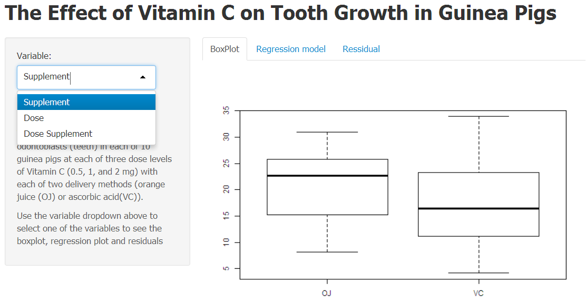

Effect of Vitamin C on Tooth Growth
========================================================
author: Developing Data Products Project
date:
transition: rotate


Problem Definition
========================================================

- A group of 10 guinea pigs were giveb each of three dose levels of Vitamin C (0.5, 1, and 2 mg) with each of two delivery methods (orange juice (OJ) or ascorbic acid (VC)).

- This tool will aid in cursory analysis to determine which of the two variables or thier interaction had the most impact on tooth growth.


Tooth Growth Data
========================================================


```r
str(ToothGrowth)
```

```
'data.frame':	60 obs. of  3 variables:
 $ len : num  4.2 11.5 7.3 5.8 6.4 10 11.2 11.2 5.2 7 ...
 $ supp: Factor w/ 2 levels "OJ","VC": 2 2 2 2 2 2 2 2 2 2 ...
 $ dose: num  0.5 0.5 0.5 0.5 0.5 0.5 0.5 0.5 0.5 0.5 ...
```

Screenshot of the Application
========================================================
 

- Select a variable from the dropdown on the left
- Navigate through the Tabs on the right to see plots and model


Thank You
========================================================

To access the application please navigate to below URL

[https://vmaradana.shinyapps.io/ShinyToothLen/](https://vmaradana.shinyapps.io/ShinyToothLen/)
